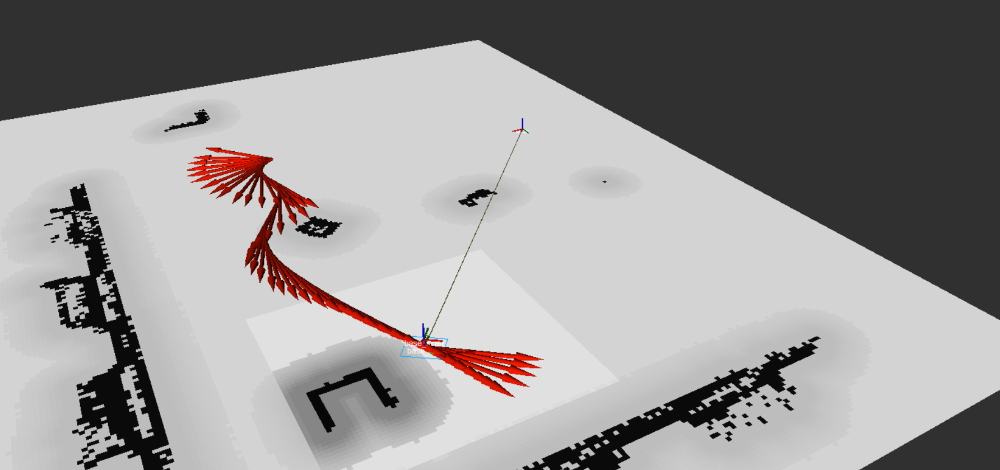

# ROS2 Nav2 差速仿真导航

基于 ROS2 + Nav2 的差速小车仿真导航项目，无需 Gazebo，使用纯软件仿真节点模拟机器人运动和激光雷达，配合 Nav2 完整导航栈实现自主路径规划与跟踪。





## 目录

- [项目结构](#项目结构)
- [流程原理](#流程原理)
- [关键文件说明](#关键文件说明)
- [快速开始](#快速开始)
- [Nav2 参数详解](#nav2-参数详解)

---

## 项目结构

```
ros2_nav2/
└── src/
    ├── fake_diff_drive/          # 仿真机器人包（主入口）
    │   ├── src/
    │   │   ├── fake_diff_drive_node.cpp   # 差速运动学仿真节点
    │   │   └── fake_scan_node.cpp         # 虚拟激光雷达节点
    │   ├── launch/
    │   │   └── sim_nav2.launch.py         # 主启动文件（一键启动全栈）
    │   └── rviz/
    │       └── nav2_sim.rviz              # RViz2 预配置文件
    └── navigation/               # Nav2 配置包
        ├── launch/
        │   └── nav2_bringup.launch.py     # Nav2 独立启动文件
        ├── map/
        │   ├── my_map.pgm                 # 栅格地图图像
        │   └── my_map.yaml                # 地图元数据
        └── params/
            └── nav2_params.yaml           # Nav2 全局参数配置
```

---

## 流程原理

### 整体架构

```
用户在 RViz2 设置目标点 (2D Nav Goal)
           │
           ▼
    bt_navigator (行为树导航器)
           │
    ┌──────┴──────┐
    ▼             ▼
planner_server   controller_server
(全局路径规划)    (局部路径跟踪)
    │             │
    ▼             ▼
global_costmap  local_costmap
(全局代价地图)   (局部代价地图)
                  │
                  ▼
           velocity_smoother
           (速度平滑输出)
                  │
                  ▼
            /cmd_vel 话题
                  │
                  ▼
       fake_diff_drive_node
       (运动学积分 → /odom + TF)
```

### TF 坐标树

```
map (静态)
 └── odom (静态，fake_diff_drive 发布)
      └── base_link (动态，50Hz 更新)
           └── base_scan (静态，激光雷达安装位置)
```

> 本项目跳过了 AMCL 定位环节，直接用静态 `map→odom` TF 代替，适合在已知地图上验证导航逻辑。

### 数据流说明

1. **fake_diff_drive_node** 订阅 `/cmd_vel`，通过差速运动学公式积分计算位姿，以 50Hz 发布 `/odom` 里程计和 `odom→base_link` 动态 TF。
2. **fake_scan_node** 以 10Hz 发布全向无障碍物的虚拟激光扫描数据到 `/scan`（所有射线距离均为最大量程 30m）。
3. **map_server** 加载 `my_map.pgm` 静态地图，发布到 `/map` 话题。
4. **planner_server** 使用 NavFn（Dijkstra/A*）在全局代价地图上规划从当前位置到目标点的全局路径。
5. **controller_server** 使用 DWB（Dynamic Window Based）局部规划器跟踪全局路径，生成速度指令。
6. **velocity_smoother** 对速度指令做平滑处理后输出到 `/cmd_vel`，驱动仿真小车运动。
7. **bt_navigator** 通过行为树协调上述各模块，处理导航失败重试、恢复行为等逻辑。

---

## 关键文件说明

| 文件 | 作用 |
|------|------|
| [`src/fake_diff_drive/src/fake_diff_drive_node.cpp`](src/fake_diff_drive/src/fake_diff_drive_node.cpp) | 差速小车仿真核心。订阅 `/cmd_vel`，积分运动学方程，发布 `/odom` 和完整 TF 树（`map→odom→base_link→base_scan`） |
| [`src/fake_diff_drive/src/fake_scan_node.cpp`](src/fake_diff_drive/src/fake_scan_node.cpp) | 虚拟激光雷达。发布 360° 全向激光扫描 `/scan`，所有射线无障碍（range_max=30m），供代价地图使用 |
| [`src/fake_diff_drive/launch/sim_nav2.launch.py`](src/fake_diff_drive/launch/sim_nav2.launch.py) | 主启动文件。一次性启动仿真节点 + 完整 Nav2 栈 + RViz2 |
| [`src/navigation/launch/nav2_bringup.launch.py`](src/navigation/launch/nav2_bringup.launch.py) | Nav2 独立启动文件，支持可选 AMCL 定位（`use_amcl:=true`） |
| [`src/navigation/map/my_map.yaml`](src/navigation/map/my_map.yaml) | 地图元数据：分辨率 0.05m/pixel，原点 (-1.8, -5, 0)，占用阈值 0.65 |
| [`src/navigation/map/my_map.pgm`](src/navigation/map/my_map.pgm) | 栅格地图图像文件（PGM 格式，白=自由，黑=障碍，灰=未知） |
| [`src/navigation/params/nav2_params.yaml`](src/navigation/params/nav2_params.yaml) | Nav2 所有节点的参数配置，包含 DWB、代价地图、行为树等完整配置 |
| [`src/fake_diff_drive/rviz/nav2_sim.rviz`](src/fake_diff_drive/rviz/nav2_sim.rviz) | RViz2 预配置，已添加地图、路径、代价地图、TF 等显示项 |

---

## 快速开始

### 前置依赖

```bash
# ROS2 Humble（或 Iron/Jazzy）
sudo apt install ros-humble-nav2-bringup ros-humble-navigation2 ros-humble-rviz2
```

### 编译

编译前注意修改[`src/navigation/params/nav2_params.yaml`](src/navigation/params/nav2_params.yaml)里面的`default_nav_to_pose_bt_xml`为绝对路径（否则会找不到自定义的行为树，这里的行为树为等待10s，没有其他行为），例如:

```
/home/aibox/Desktop/ros2_nav2/src/navigation/behavior_trees/navigate_to_pose_w_wait.xml
```

```bash
cd ~/Desktop/ros2_nav2
colcon build --symlink-install
```

### 加载环境

```bash
source install/setup.bash
```


### 启动导航仿真

```bash
ros2 launch fake_diff_drive sim_nav2.launch.py
```

启动后会自动打开 RViz2，等待所有 Nav2 节点进入 `active` 状态（终端输出 `Lifecycle transition successful`）。

### 发布导航目标

在 RViz2 工具栏点击 **"2D Nav Goal"** 按钮，然后在地图上点击并拖拽设置目标位置和朝向，即可看到：

1. 绿色全局路径规划出现
2. 小车（`base_link`）开始沿路径移动
3. 局部代价地图随小车实时更新

可以在终端中执行如下命令查看导航任务的状态：
```
ros2 topic echo /navigate_to_pose/_action/status
```

### 使用 Python 脚本发送目标并循环监听状态

本仓库已提供脚本：

`src/navigation/scripts/nav_goal_status_monitor.py`

功能：
- 发送 `NavigateToPose` goal（等价于给 Nav2 发目标点）
- 订阅并循环监听 `/navigate_to_pose/_action/status`
- 打印状态流转（`ACCEPTED -> EXECUTING -> SUCCEEDED/ABORTED/CANCELED`）

使用方式（先 `colcon build --symlink-install` 并 `source install/setup.bash`）：

```bash
ros2 run nav2_bringup_custom nav_goal_status_monitor.py --x 1.0 --y 0.5 --yaw 1.57
```

可选参数：
- `--frame-id`（默认 `map`）
- `--wait-server-sec`（默认 `10.0`）

状态码说明（`action_msgs/msg/GoalStatus`）：
- `0`: UNKNOWN
- `1`: ACCEPTED
- `2`: EXECUTING
- `3`: CANCELING
- `4`: SUCCEEDED
- `5`: CANCELED
- `6`: ABORTED


### 可选启动参数

```bash
# 使用自定义地图
ros2 launch fake_diff_drive sim_nav2.launch.py map:=/path/to/your_map.yaml

# 使用自定义参数文件
ros2 launch fake_diff_drive sim_nav2.launch.py params_file:=/path/to/params.yaml
```

---

## Nav2 参数详解

> 参数文件位置：[`src/navigation/params/nav2_params.yaml`](src/navigation/params/nav2_params.yaml)

### controller_server（局部规划器）

使用 **DWB（Dynamic Window Based）** 局部规划器：

| 参数 | 值 | 含义 |
|------|----|------|
| `controller_frequency` | 20.0 Hz | 控制循环频率，越高响应越快 |
| `xy_goal_tolerance` | 0.25 m | 到达目标点的位置容差 |
| `yaw_goal_tolerance` | 0.25 rad | 到达目标点的朝向容差 |
| `max_vel_x` | 0.5 m/s | 最大前进速度 |
| `max_vel_theta` | 1.0 rad/s | 最大旋转角速度 |
| `acc_lim_x` | 2.5 m/s² | 线加速度限制 |
| `acc_lim_theta` | 3.2 rad/s² | 角加速度限制 |
| `sim_time` | 1.7 s | DWB 轨迹前向仿真时长，越长越平滑但计算量越大 |
| `vx_samples` | 20 | 线速度采样数量 |
| `vtheta_samples` | 20 | 角速度采样数量 |

**DWB Critics（评分函数）：**

| Critic | scale | 作用 |
|--------|-------|------|
| `PathAlign` | 32.0 | 轨迹与全局路径对齐程度 |
| `PathDist` | 32.0 | 轨迹终点到全局路径的距离 |
| `GoalAlign` | 24.0 | 轨迹朝向目标点对齐程度 |
| `GoalDist` | 24.0 | 轨迹终点到目标点的距离 |
| `RotateToGoal` | 32.0 | 接近目标时原地旋转对齐朝向 |
| `BaseObstacle` | 0.02 | 避障惩罚（scale 低因为是无障碍仿真环境） |
| `Oscillation` | — | 防止来回震荡 |

### planner_server（全局规划器）

使用 **NavFn（Dijkstra/A*）** 全局规划器：

| 参数 | 值 | 含义 |
|------|----|------|
| `expected_planner_frequency` | 20.0 Hz | 期望规划频率 |
| `tolerance` | 0.5 m | 目标点不可达时的容差半径 |
| `use_astar` | false | false=Dijkstra，true=A*（A* 更快但路径质量略低） |
| `allow_unknown` | true | 允许穿越未知区域规划路径 |

### local_costmap（局部代价地图）

| 参数 | 值 | 含义 |
|------|----|------|
| `update_frequency` | 5.0 Hz | 代价地图更新频率 |
| `rolling_window` | true | 以机器人为中心滚动窗口 |
| `width / height` | 3 m | 局部代价地图尺寸 |
| `resolution` | 0.05 m | 每个栅格的物理尺寸 |
| `inflation_radius` | 0.55 m | 障碍物膨胀半径（机器人安全距离） |
| `cost_scaling_factor` | 3.0 | 膨胀层代价衰减系数，越大衰减越快 |
| `footprint` | 0.42×0.33 m | 机器人实际轮廓（矩形） |

**局部代价地图层：**
- `voxel_layer`：从 `/scan` 激光数据动态标记障碍物
- `static_layer`：叠加静态地图信息
- `inflation_layer`：对障碍物进行膨胀，保证安全距离

### global_costmap（全局代价地图）

| 参数 | 值 | 含义 |
|------|----|------|
| `update_frequency` | 1.0 Hz | 全局代价地图更新频率（较低，节省计算） |
| `track_unknown_space` | true | 将未知区域标记为可通行（配合 allow_unknown） |
| `resolution` | 0.05 m | 与地图分辨率一致 |

**全局代价地图层：**
- `static_layer`：加载静态地图作为基础障碍信息
- `obstacle_layer`：叠加激光雷达实时障碍物
- `inflation_layer`：障碍物膨胀

### velocity_smoother（速度平滑器）

| 参数 | 值 | 含义 |
|------|----|------|
| `smoothing_frequency` | 20.0 Hz | 平滑输出频率 |
| `feedback` | OPEN_LOOP | 开环模式（不依赖实际速度反馈） |
| `max_velocity` | [0.5, 0.0, 1.0] | [线速度, 横向速度, 角速度] 最大值 |
| `max_accel` | [2.5, 0.0, 3.2] | 最大加速度限制 |
| `max_decel` | [-2.5, 0.0, -3.2] | 最大减速度限制 |
| `velocity_timeout` | 1.0 s | 超时后发送零速度停止机器人 |

### behavior_server（恢复行为）

当导航卡住时自动触发的恢复行为：

| 行为 | 插件 | 说明 |
|------|------|------|
| `spin` | `nav2_behaviors/Spin` | 原地旋转，尝试重新定位 |
| `backup` | `nav2_behaviors/BackUp` | 后退一小段距离 |
| `wait` | `nav2_behaviors/Wait` | 等待障碍物消失 |
| `drive_on_heading` | `nav2_behaviors/DriveOnHeading` | 沿当前朝向前进 |

### bt_navigator（行为树导航器）

| 参数 | 值 | 含义 |
|------|----|------|
| `bt_loop_duration` | 10 ms | 行为树执行循环间隔 |
| `default_server_timeout` | 20 s | 等待服务器响应的超时时间 |
| `navigators` | navigate_to_pose, navigate_through_poses | 支持单点导航和多点路径导航 |

### waypoint_follower（路径点跟随）

| 参数 | 值 | 含义 |
|------|----|------|
| `loop_rate` | 20 Hz | 路径点检查频率 |
| `stop_on_failure` | false | 某个路径点失败后继续执行后续点 |
| `waypoint_pause_duration` | 200 ms | 到达每个路径点后的停留时间 |

### 注意事项

* `xy_goal_tolerance`修改时`general_goal_checker`和`FollowPath`里面的要一致